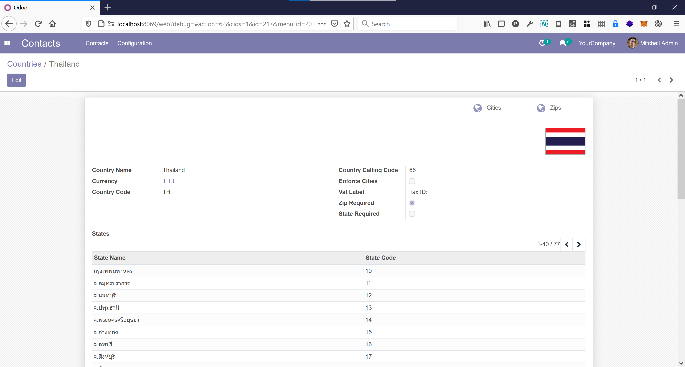
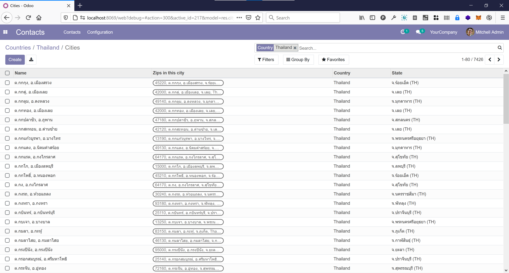
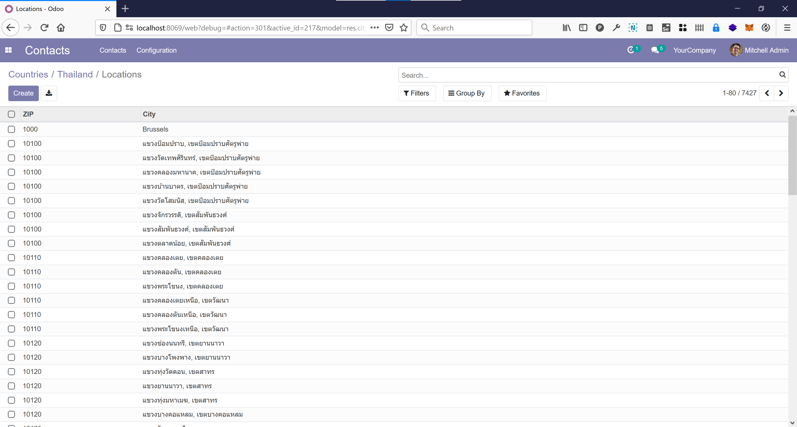
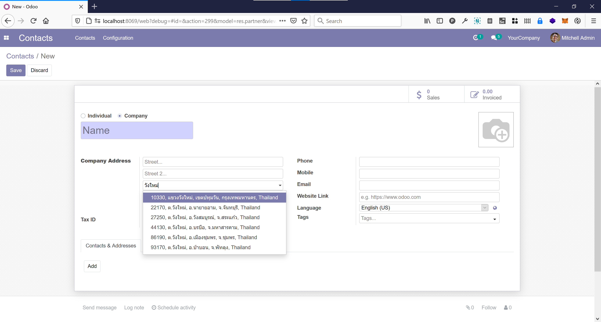
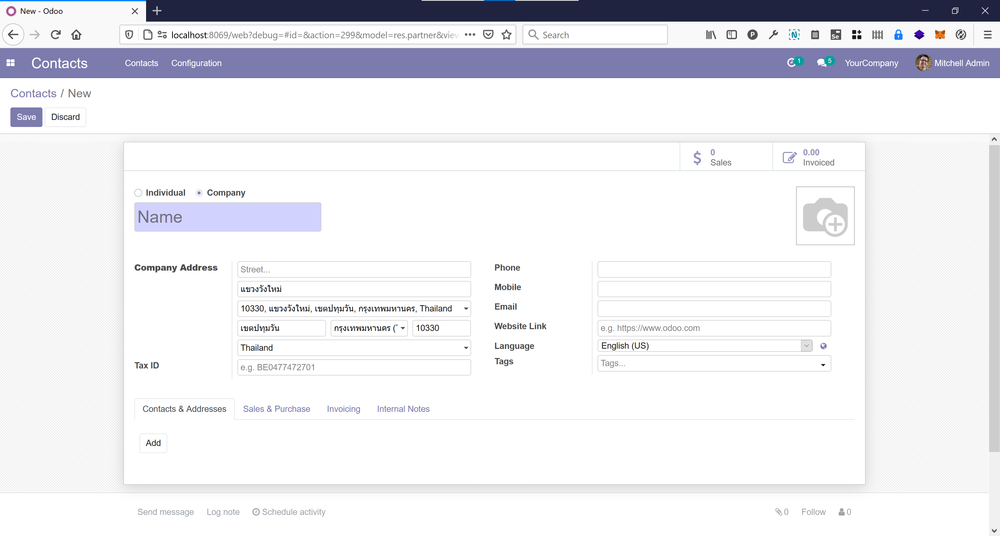
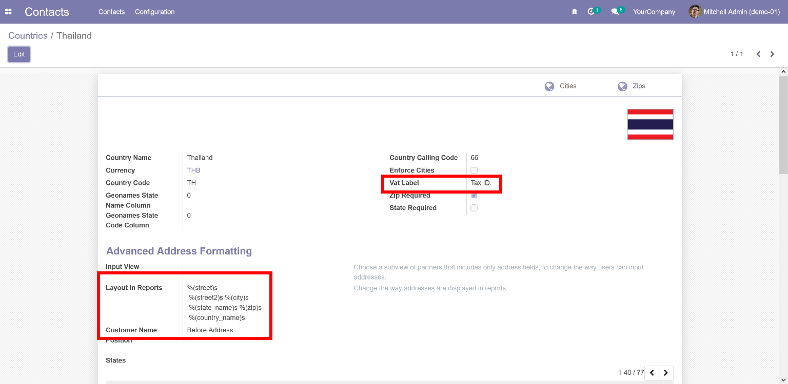

โมดูลช่วยนำเข้าข้อมูลตำบล, อำเภอ, จังหวัด, รหัสไปรษณีย์ เป็นภาษาไทย (หรือภาษาอังกฤษ) และตั้งค่าต่างๆให้พร้อมใช้งาน

สิ่งที่โมดูลนี้ทำ
---------------
* กรณีที่ภาษาหลักที่ใช้ไม่ใช่ภาษาไทย โมดูลนี้จะเพิ่มภาษาไทยเป็นภาษาที่ 2 และนำเข้าคำแปลภาษาไทยในระบบ. 
* ติดตั้งโมดูล `Base Location Geonames Import <https://github.com/OCA/partner-contact/tree/14.0/base_location_geonames_import>`_ ซึ่งโมดูลนี้จะติดตั้งโมดูล `Location management (aka Better ZIP) <https://github.com/OCA/partner-contact/tree/14.0/base_location>`_ อีกที
* ตั้งค่า system parameter ``geonames.url`` สำหรับดึงข้อมูล ตำบล, อำเภอ, จังหวัด และรหัสไปรษณีย์ เป็นภาษาไทย. หากต้องการเป็นภาษาอังกฤษ หรือผสมกัน สามารถเปลี่ยนได้ภายหลัง
* เปลี่ยน form โดยสลับตำแหน่งให้ Location completion ขึ้นมาก่อน street2. เวลาพิมพ์ที่อยู่ ลำดับการกรอกข้อมูลจะเป็นธรรมชาติกว่า คือ บ้านเลขที่, ถนน ใส่ในช่อง street1 ตามด้วย Location completion. ถ้าเลือกตำบลอำเภอเสร็จแล้ว จะกรอกใส่ช่องด้านล่าง ตามลำดับจากด้านบนไปด้านล่าง.
* ระหว่างติดตั้ง จะนำเข้า (import) ข้อมูล ตำบล, อำเภอ, จังหวัด และรหัสไปรษณีย์ เป็นภาษาไทยอัตโนมัติ. เมื่อติดตั้งโมดูลเสร็จแล้ว ข้อมูลพร้อมใช้งานทันที ลดขั้นตอนการนำเข้าข้อมูลเอง

* เวลาใช้ Location completion ค้นหาที่อยู่ (ตำบล, อำเภอ, จังหวัด, รหัสไปรษณีย์) เมื่อเลือกข้อมูลที่ค้นหาได้แล้ว จะใส่ชื่อตำบลในช่อง Street2 และใส่ชื่ออำเภอในช่อง Ciy ให้อัตโนมัติ

* เปลี่ยนค่า ``address_format`` ให้ใช่้ชื่อ จังหวัด ``state_name`` แทน ``state_id`` ที่เป็นค่าตั้งต้น
* ตั้งค่า Vat Label เป็น Tax ID

ลองใช้งาน th_address จาก docker image
-----------------------------------------
โมดูลนี้รวมไว้ใน `docker odoo-th <https://github.com/poonlap/odoo-th>`_ แล้ว สามารถลองใช้ได้ทันที.::

    $ git clone https://github.com/poonlap/odoo-th.git
    $ cd odoo-th/docker
    $ docker-compose up
