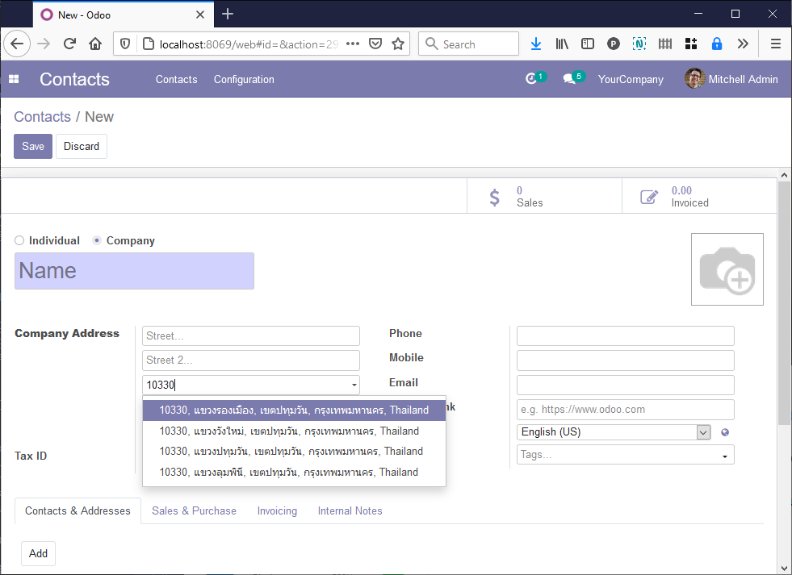
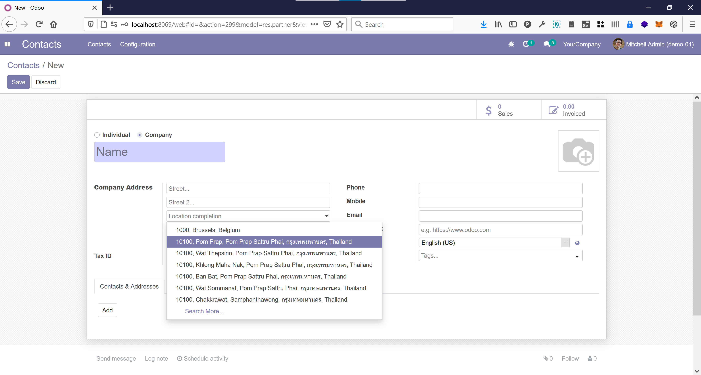
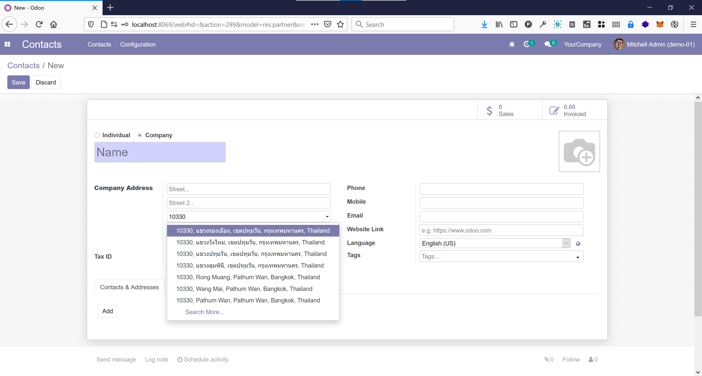

สร้าง Contact หรือลูกค้าใหม่
------------------------
กรอกชื่อที่อยู่ตามปกติ เมื่อจะเริ่มกรอกตำบลหรือแขวง ให้ไปที่ช่อง "Location completion"

กรอกคำที่ต้องการค้นหา เช่น ชื่อตำบล หรือ ชื่ออำเภอ หรือ รหัสไปรษณีย์ แล้วเลือกข้อมูลที่ระบบหามาให้. ระบบจะเติมช่อง street2 ให้เป็นตำบล, ช่อง city เป็นอำเภอ, ช่อง state เป็นจังหวัด เติมรหัสไปรษณีย์ให้อัตโนมัติ สามารถป้องกันความผิดพลาดกรณีผู้ใช้กรอกผิดได้

นำเข้าข้อมูลที่อยู่เป็นภาษาอังกฤษ
---------------------------------
* เข้า developer mode
* ไปที่ Settings > Technical > System Parameters
* แก้ค่าตัวแปร ``geonames.url`` เป็น::

    https://github.com/poonlap/odoo-th/raw/14.0/th_address/data/en/%s.zip

* ไปที่ Contacts > Configuration > Import from Geonames
* เลือก Thailand และกดปุ่ม import

* กรณีที่ต้องการข้อมูลผสม ภาษาไทยและอังกฤษ ให้ตั้งค่า ``geonames.url`` เป็น::

    https://github.com/poonlap/odoo-th/raw/14.0/th_address/data/th_en/%s.zip

* ถ้าต้องการนำเข้าข้อมูลที่อยู่ประเทศอื่นๆ ให้ลบ system parameter ``geonames.url`` ทิ้ง. แล้วโมดูล `Base Location Geonames Import <https://github.com/OCA/partner-contact/tree/14.0/base_location_geonames_import>`_ จะดาวน์โหลดข้อมูลจากแหล่งที่เตรียมไว้ให้เอง.