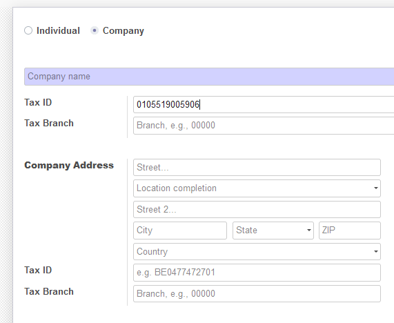
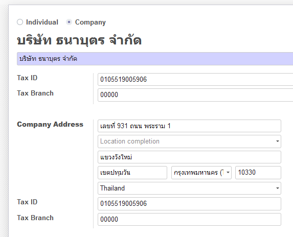
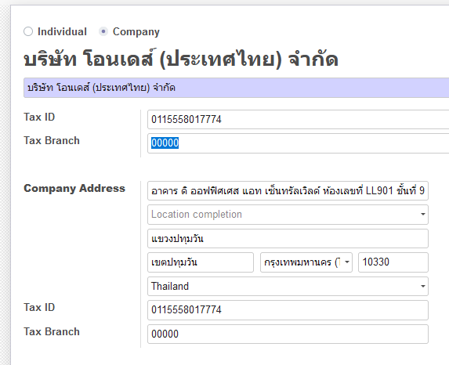
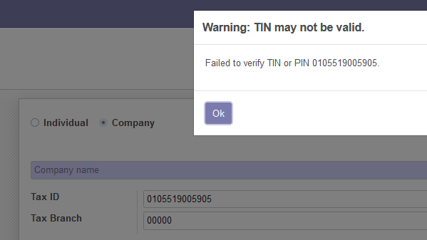

โมดูลนี้ตั้งอยู่บนสมมติฐานที่ว่า รู้เลขประจำตัวผู้เสียภาษี 13 หลักของลูกค้าอยู่แล้ว และต้องการให้ระบบหาและกรอกที่อยู่ให้อัตโนมัติ.

* ไปหน้า Contacts และสร้างลูกค้าใหม่. 
* ไม่ต้องการชื่อบริษัท กรอกเลขประจำตัวผู้เสียภาษี 13 หลักที่ช่อง Tax ID

* กดคีย์บอร์ด `Tab` หรือคลิกไปที่ช่องข้อมูลอื่น. ระบบจะติดต่อกับเว็บเซอร์วิสของกรมสรรพกร เช็คเลขประจำตัวผู้เสียภาษีว่ามีอยู่จริงหรือไม่.
* ถ้าเลขประจำตัวผู้เสียภาษีถูกต้อง โมดูลนี้จะใส่ ชื่อบริษัทและที่อยู่ที่ได้จากเว็บเซอร์วิสของกรมสรรพากรให้ตามช่องข้อมูลที่เหมาะสมอัตโนมัติ 

* โมดูลนี้จะกรอกข้อมูลเป็นสำนักงานใหญ่ เลขสาขา 00000 เป็นค่าเริ่มต้น.
* กรณีที่บริษัทมีหลายสาขา สาขาหาที่อยู่ของสาขาอื่นๆได้โดยเปลี่ยนเลขสาขาในช่องสาขา แล้วกดคีย์ `Tab`

.. figure:: ../static/description/another_branch.png
   :alt: Another branch
   :width: 80 %
   :align: center

* แจ้งเตือนกรณีเลขประจำตัวผู้เสียภาษีไม่ถูกต้อง

* แจ้งเตือนกรณีเลขที่สาขาไม่ถูกต้อง หรือไม่มีเลขที่สาขานั้นๆ

.. figure:: ../static/description/branch_validation.png
   :alt: Validate Branch
   :width: 80 %
   :align: center

* แจ้งเตือนกรณีเลขที่สาขาไม่ใช่ตัวเลขหรือเลขไม่ครบ 5 หลัก

.. figure:: ../static/description/branch_format.png
   :alt: Verify Branch number format
   :width: 80 %
   :align: center
